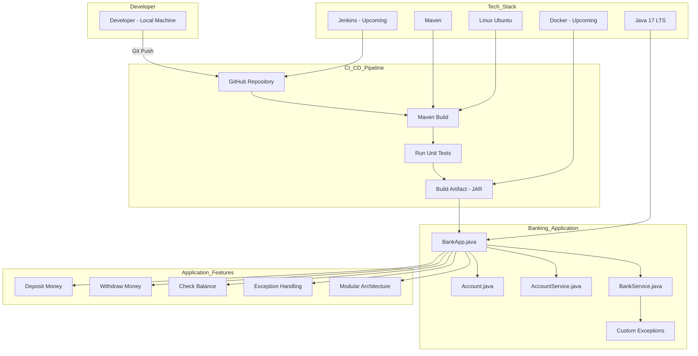

# Java Banking Application – CI/CD DevOps Project 🚀
```md
## 📌 Overview
This project is a **menu-driven Java Banking Application** developed using **Java 17 (LTS)** and **Maven**.  
It is designed with **clean architecture**, proper **exception handling**, and is structured in a way that makes it **ready for Dockerization and CI/CD automation** using Jenkins.



