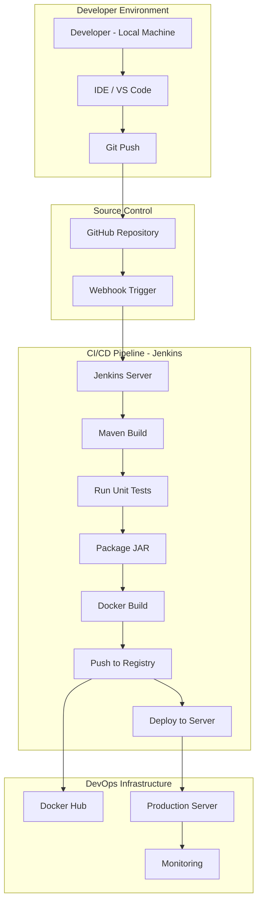
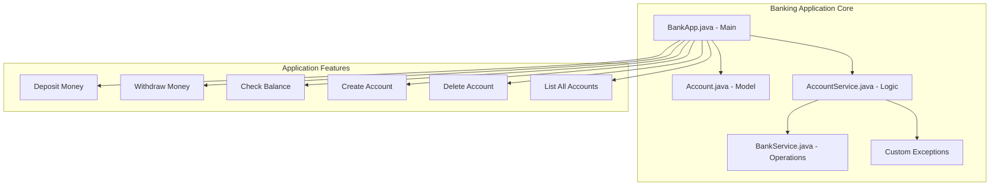
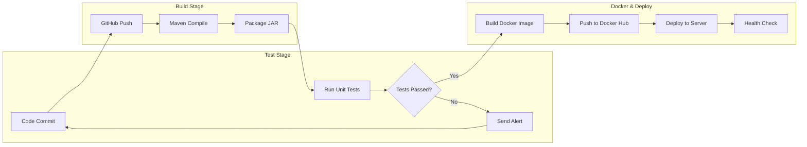
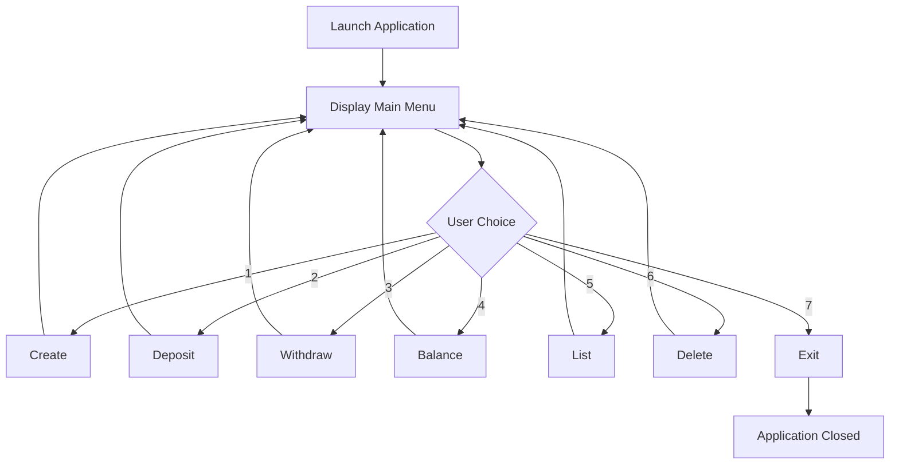
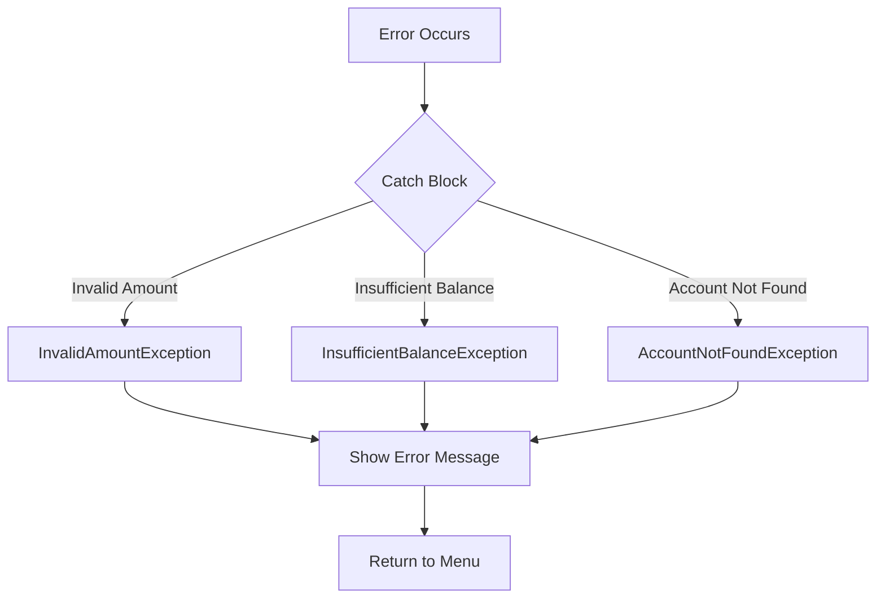
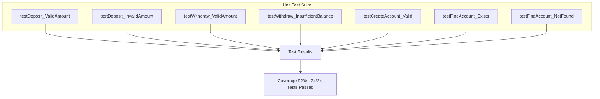

# 🏦 Java Banking Application – CI/CD DevOps Project 🚀

---

## 📌 Overview

This project is a **menu-driven Java Banking Application** developed using **Java 17 (LTS)** and **Maven**.

It follows a clean modular architecture with proper exception handling and is structured to be fully ready for:

- 🐳 Docker containerization  
- 🤖 Jenkins CI/CD automation  
- 🧪 Unit testing integration  
- 🚀 Production deployment  

This project demonstrates both **Core Java skills** and **DevOps engineering practices**.

---

# 🏗️ 1️⃣ Complete DevOps Architecture

---

# 🏦 2️⃣ Application Architecture

---

# 🔁 3️⃣ CI/CD Pipeline Stages

---

# 📱 4️⃣ Application Flow (Menu Driven System)

---

# ⚠ 5️⃣ Exception Handling Flow

---

# 🧪 6️⃣ Unit Testing Overview

---

# 🛠 Tech Stack

- ☕ Java 17 (LTS)  
- 📦 Maven  
- 🧪 JUnit 5  
- 🐧 Linux / Ubuntu  
- 🐳 Docker  
- 🤖 Jenkins  
- 🐙 GitHub  

---

# 🚀 Project Highlights

- Clean modular architecture  
- CI/CD ready design  
- Docker-ready structure  
- Automated unit testing  
- DevOps pipeline integration  
- Production deployment capable  

---

💡 This project represents a complete **Java + DevOps integration workflow**
